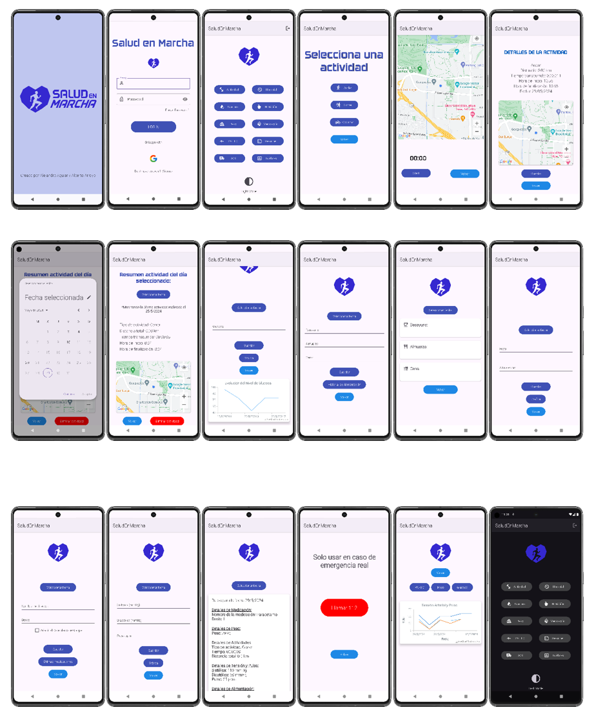
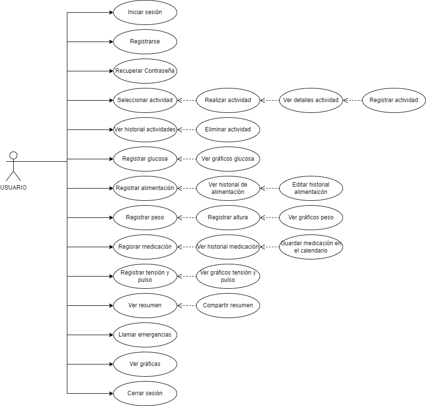

# Proyecto de Desarrollo de Aplicaciones Multiplataforma 

# UNIR – FP

## Componentes del grupo:

### Alejandro Aguiar Díaz
https://github.com/aleaguiard

### Alberto Arroyo Santofimia
https://github.com/AlbertoArroyoS

# SaludEnMarcha 

SaludEnMarcha es una aplicación móvil diseñada para dispositivos Android que integra funcionalidades clave relacionadas con la actividad física, la alimentación y el seguimiento de parámetros de salud. 
La aplicación permite a los usuarios registrar su actividad física utilizando el GPS de sus dispositivos móviles para mapear rutas y calcular distancias recorridas. 
Además, ofrece la posibilidad de registrar la ingesta de alimentos y otros parámetros de salud como la medicación, el pulso y el peso. 
También incluye un botón de emergencia que conecta al usuario con el servicio de emergencias 112 en caso de necesidad urgente.

## Diagrama de Base de Datos Firebase

## Diagrama de flujo de activities

## Diagrama de clases 

## Diagrama de casos de usos

